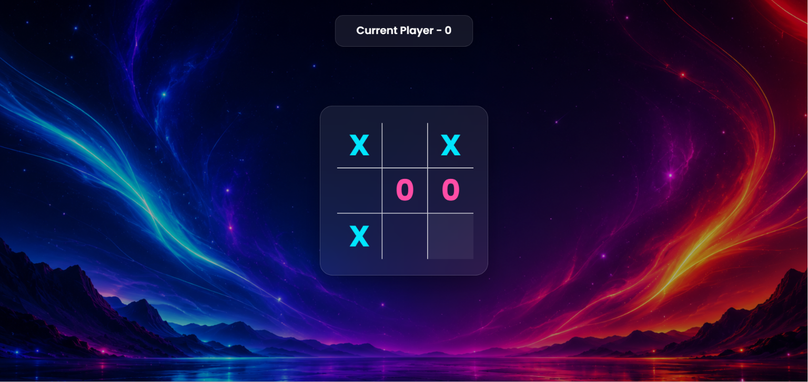
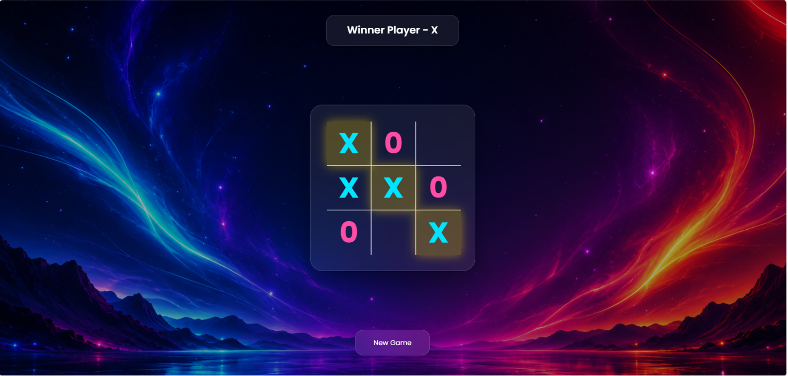
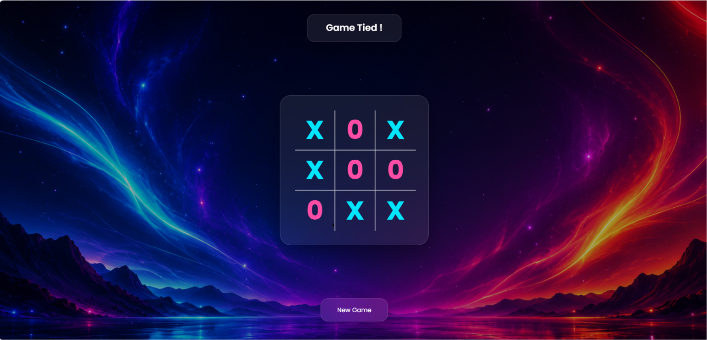

# 🎮 Tic Tac Toe

A simple and responsive Tic Tac Toe game built using HTML, CSS, and JavaScript. This project allows two players to play the classic Tic Tac Toe game with an interactive and user-friendly interface.

## 🚀 Live Demo

https://yadavsawan4062-hub.github.io/TicTacToe/

## 📸 Screenshots

### 🏠 Home Screen



### ❌⭕ Gameplay


### 🏆 Winner Announcement



### 🔄 New Game / Reset



## ✨ Features

* Two Player Gameplay
* Interactive Game Board
* Winner Detection
* Draw Game Detection
* New Game Button
* Reset Game Option
* Responsive User Interface
* Smooth User Experience
* Beginner-Friendly JavaScript Project

## 🛠️ Technologies Used

* HTML5
* CSS3
* JavaScript

## 📂 Project Structure

```text
TicTacToe/
│
├── index.html
├── style.css
├── script.js
└── assets/
    └── gradient-bg.jpg
```

## 💻 How to Run

1. Clone the repository

```bash
git clone https://github.com/yadavsawan4062-hub/TicTacToe.git
```

2. Open the project folder

```bash
cd TicTacToe
```

3. Open `index.html` in your browser

## 👨‍💻 Author

**Sawan Yadav**

GitHub: https://github.com/yadavsawan4062-hub
